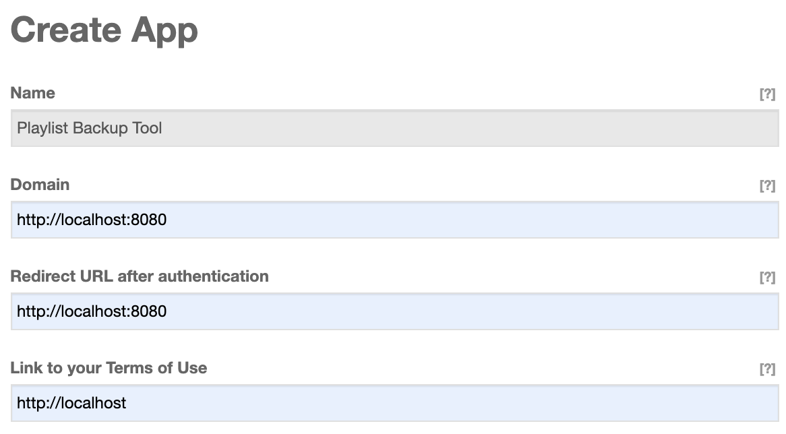

# ym-to-deezer-migrate

Tool to move your Yandex Music playlists to Deezer

## Prerequisites

- OS: Linux or MacOS
- perl/curl/vim

## User Deezer App

Go to [Create Deezer App](https://developers.deezer.com/myapps/create) and create your own.

Example:



Get the `Application ID` and `Secret Key`.

## Run

1. Generate auth file:

```bash
echo "MyYandexUser MyAddID MySecretKey" | tee ./auth
./ym-to-deezer.sh
```
